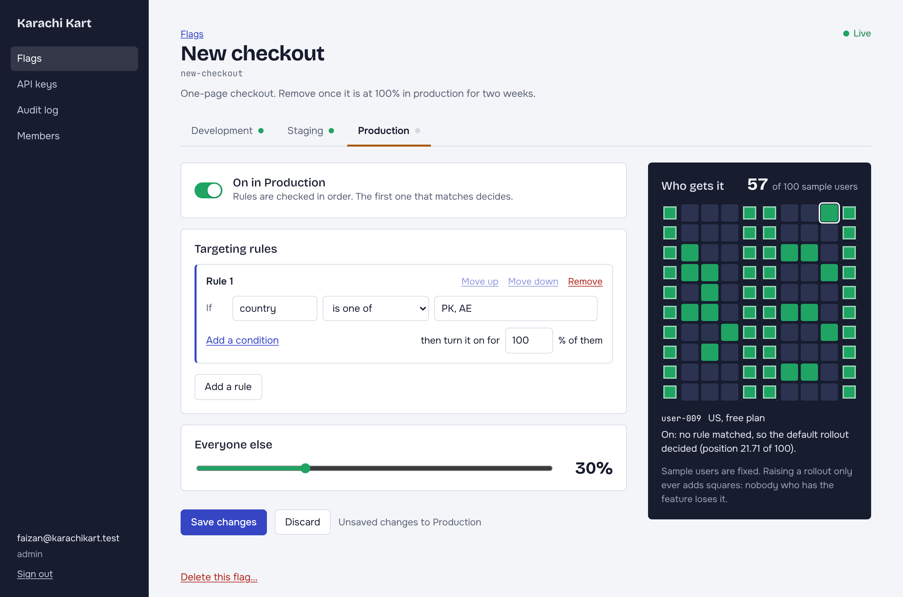
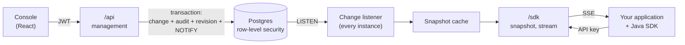
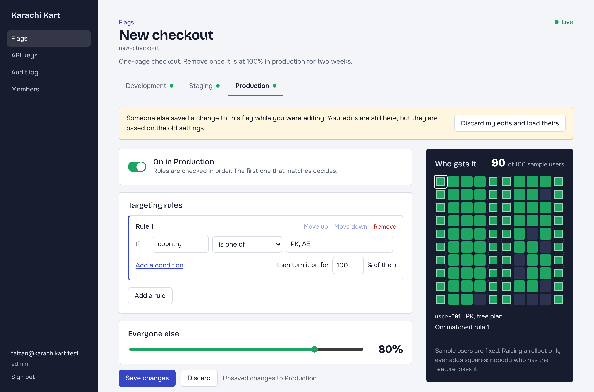
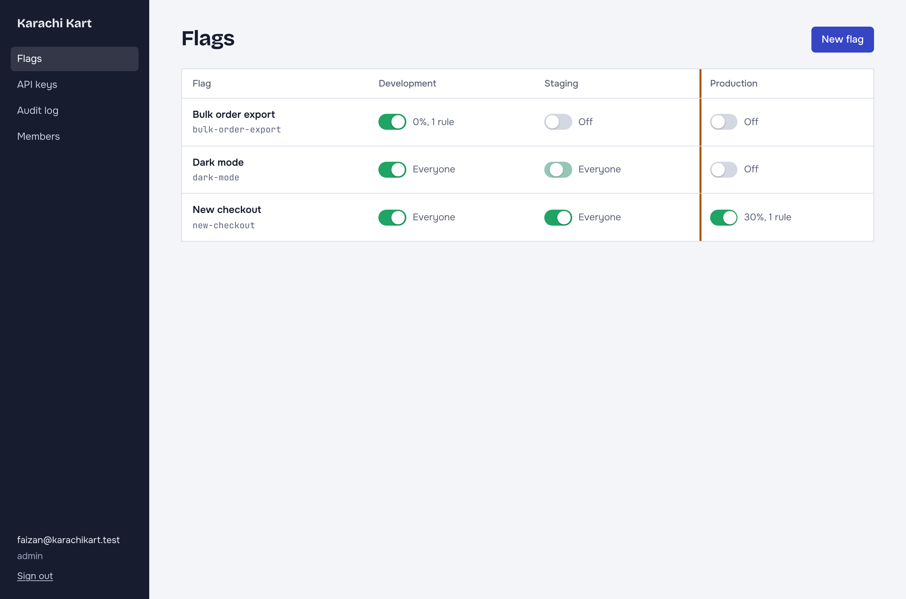
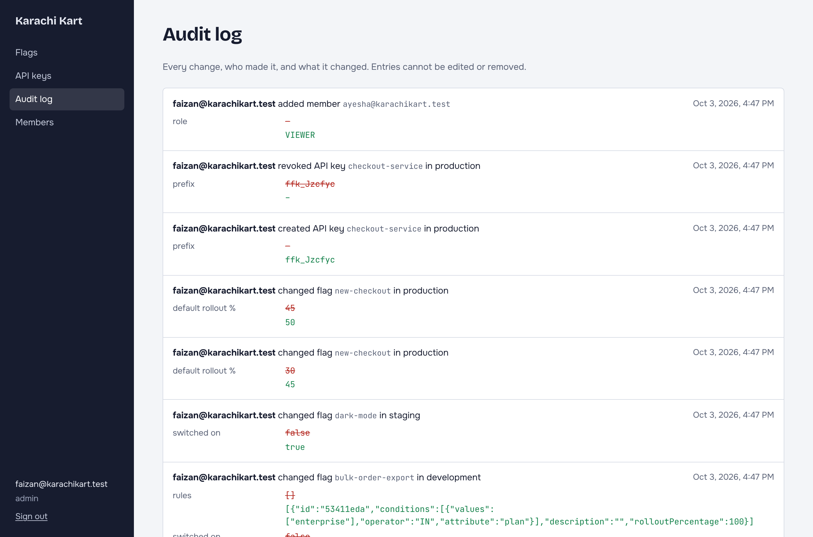

# Feature flags: tenant isolation the application cannot forget

[](../../actions/workflows/ci.yml)

A multi-tenant feature flag service: a console where teams switch features on for a share of their users, and an SDK that applications use to ask "is this on for this user?". It is built around three guarantees, each backed by tests against a real Postgres:

1. **One tenant can never read or change another's data**, even if the application code has a bug. Postgres enforces it, not a `WHERE` clause.
2. **A rollout is sticky.** A user who has a feature at 10% still has it at 20%, on every server and in every SDK.
3. **A committed change reaches every connected SDK within moments, and a change that rolled back reaches none.**

Spring Boot 4.1 / Java 21 / Postgres 16 on the back, React 18 / TypeScript on the front.



*One flag in production: everyone in Pakistan and the UAE, and 30% of everyone else. Each square is a sample user. The outlined ones were decided by the rule, the solid ones by the rollout.*

## The problem

**Isolation by convention.** The usual way to build a multi-tenant service is to add `tenant_id = ?` to every query. That works until someone writes the one query that forgets it, and then one customer sees another's data. Nothing fails, no test notices, and the code looks fine in review because the bug is a line that is not there.

**Rollouts that reshuffle.** "Turn it on for 20% of users" is easy to get wrong. Pick randomly per request and a user flickers between old and new. Pick by `userId % 100` and the same users are first into every experiment you ever run. Either way, raising 10% to 20% must not take the feature away from anyone who already had it.

**Stale rules.** Applications check flags on every request, so they cannot call a server each time. They hold the rules in memory. The moment someone flips a kill switch, every copy of those rules on every server is wrong, and the system is only as good as how fast and how reliably it corrects them.

## How it works



### Tenant isolation in the database

The application connects to Postgres as a role that owns nothing. Every tenant-owned table has a row-level security policy, `tenant_id = current_tenant()`, and every transaction starts by telling Postgres who it is working for:

```sql
select set_config('app.tenant_id', '<uuid>', true)
```

That one statement is issued by a custom transaction manager ([`TenantAwareTransactionManager`](server/src/main/java/dev/flags/server/tenancy/TenantAwareTransactionManager.java)), so no service or repository takes part. The repositories contain no tenant predicates at all: `flags.findByKey(key)` is the whole query.

Four details make this hold up:

- **The setting is transaction-scoped.** The `true` is `SET LOCAL`. A session-level setting would survive on a pooled connection and leak to the next request, which is the exact failure this design exists to prevent.
- **It fails closed.** With no tenant set, `current_tenant()` is `NULL`, nothing equals `NULL`, and every table looks empty.
- **Foreign keys are composite.** Foreign-key checks bypass row-level security, so a plain `flag_id REFERENCES flags` would let a tenant attach its row to another tenant's flag by guessing an id. Every cross-table reference is `(tenant_id, id)`.
- **Two questions are asked before the tenant is known**: whose email is this, and whose API key is this. Those go through two `SECURITY DEFINER` functions that return only what authentication needs. They are the only cross-tenant reads in the system.

### Sticky rollouts

A user's position in a flag's rollout is the first eight bytes of `SHA-256(salt + ":" + userKey)`, modulo 10,000. A rollout of *p* percent includes positions below *p* × 100.

- The position depends only on the salt and the key, so every server and SDK computes the same answer with no shared state.
- Raising the percentage only adds positions, so nobody drops out.
- Each flag has its own salt, so being early into one rollout says nothing about the next.

The evaluator lives in [`core`](core/src/main/java/dev/flags/core), a module with no dependencies that the server and the SDK both use. They cannot disagree, because they run the same code.

### Getting changes to SDKs

A change to a flag does four things in one database transaction: updates the configuration, writes the audit entry, increments the environment's revision, and calls `pg_notify`. Postgres delivers a notification only when its transaction commits, so listeners hear about exactly the changes that happened.

Every instance of the server holds one connection that `LISTEN`s. On a notification it re-reads that environment, replaces its cached snapshot, and pushes the new one down every open stream. Instances do not know about each other and there is no broker: the database that made the change durable also announces it.

Two things keep the cache correct under races:

- **Newest revision wins.** A cache entry is only ever replaced by one with a higher revision, so it does not matter whether a slow loader or a notification finishes first.
- **Snapshots are read at `REPEATABLE READ`.** A snapshot's revision and its contents come from two statements. At the default isolation level a change could commit between them and produce new contents labelled with the old revision.

Each stream has a one-slot mailbox instead of a queue. A snapshot is the whole state, so a slow client has no use for the ones it missed, and memory per client is bounded at one snapshot.

The [Java SDK](sdk/src/main/java/dev/flags/sdk/FlagClient.java) evaluates locally, so a flag check never touches the network. If the service is unreachable it keeps answering from the last rules it received and reconnects with jittered backoff.

### Who can do what

- **People** sign in to the console and get a JWT (Spring Security resource server, HS256). The token says who they are, not what they may do: the role is read from the database on every request, so demoting or removing someone takes effect on their next request and not when their token expires.
- **Applications** use API keys scoped to one environment. Keys are 32 random bytes, stored only as a SHA-256 hash, shown once. Revoking one closes its open streams on every instance.
- Three roles, each including the one below: viewer, editor, admin. Checks are `@PreAuthorize` on the service methods.
- **Concurrent edits** are caught by an optimistic lock. The console sends back the version it loaded, and an edit based on a stale version is refused with 409 instead of silently undoing someone else's change.
- **The audit log is append-only at the database level.** The application's role has `SELECT` and `INSERT` on it and nothing else.



*Someone else saved while this tab had unsaved edits. The console heard about it over the stream. An untouched tab would simply have updated.*

## What the tests prove

Integration tests start the whole application on a real port against a real Postgres, and talk to it over HTTP and through the SDK. Nothing is mocked. Tests never clean up: each signs up its own organizations, and isolation keeps them apart.

**Isolation** ([`TenantIsolationIT`](server/src/test/java/dev/flags/server/TenantIsolationIT.java))

| Test | What must hold |
|---|---|
| `aQueryWithNoTenantFilterStillReturnsOnlyTheCurrentTenantsRows` | `findAll()` and a raw `select count(*)` see only the current tenant |
| `withNoTenantSetEveryTableLooksEmpty` | No tenant, no rows, in every table |
| `aTenantCannotUpdateOrDeleteAnothersRowsEvenByNamingThem` | `UPDATE … WHERE tenant_id = <theirs>` changes 0 rows |
| `aTenantCannotInsertARowThatBelongsToAnother` | Rejected by the policy's `WITH CHECK` |
| `aTenantCannotAttachItsOwnRowToAnothersByGuessingAnId` | Rejected by the composite foreign key |
| `theTenantSettingDoesNotSurviveOnAPooledConnection` | 50 alternating transactions on the pool never see each other's tenant |
| `everyTableThatHoldsTenantDataIsProtected` | Any table with a `tenant_id` and no policy fails the build; guards future migrations |
| `theApplicationsRoleHasNoWayAroundThePolicies` | Not a superuser, no `BYPASSRLS`, owns no tables |
| `theAuditLogCannotBeRewrittenByTheApplication` | `UPDATE` and `DELETE` on the audit log are denied |

**Delivery** ([`SdkDeliveryIT`](server/src/test/java/dev/flags/server/SdkDeliveryIT.java))

| Test | What must hold |
|---|---|
| `aChangeCommittedByAnotherInstanceReachesThisInstancesSdks` | A change written straight to the database by a separate connection, as a second instance would, reaches this instance's SDKs |
| `aChangeThatRolledBackIsNeverAnnounced` | A rolled-back transaction that called `pg_notify` announces nothing |
| `aBurstOfChangesLeavesEverySdkOnTheLastOneWithoutGoingBackwards` | After 30 rapid changes every SDK is on the last, and revisions only ever increased |
| `theSdkAndTheServerAgreeOnEveryUser` | Local and server-side evaluation match for 300 users under a rule plus a partial rollout |
| `wideningARolloutKeepsEveryoneWhoAlreadyHadTheFeature` | 5% → 20% → 50% → 100% for 500 users: each set contains the last |
| `revokingAKeyCutsOffItsOpenStreamAndItsNextRequest` | The stream is closed, the next request is 401, and the SDK stops retrying |

**Access control and editing** ([`AccessControlIT`](server/src/test/java/dev/flags/server/AccessControlIT.java), [`FlagLifecycleIT`](server/src/test/java/dev/flags/server/FlagLifecycleIT.java)): forged, expired and cross-tenant tokens are refused; each role is checked against what it may not do; a demotion or removal applies to the very next request; an organization cannot lose its last administrator; of eight simultaneous edits to one version exactly one wins; a refused change leaves no audit entry.

The evaluator's own tests pin the hash with golden values computed independently in Python, so an SDK in another language has a contract to match.

| Module | Tests |
|---|---|
| `core` | 38 |
| `sdk` | 11 |
| `server` | 6 unit, 50 integration |
| `frontend` | 11 |

Two mutations were tried against the suite to check that it bites. Making the tenant setting session-level instead of transaction-level failed two isolation tests. Making the listener ignore notifications failed the delivery tests.

## Design decisions

- **Row-level security, not a schema or database per tenant.** Separate schemas isolate well but make migrations and connection pooling scale with the number of tenants. RLS keeps one schema and one pool. The cost is that the policy is evaluated on every row access, and that the guarantee depends on the application never connecting as the owner; a test asserts that.
- **RLS is not `FORCE`d.** Forcing it would apply the policies to the table owner too, and the two authentication functions rely on the owner being exempt. The owner's credentials are used only by Flyway.
- **Postgres `LISTEN/NOTIFY`, not Redis or Kafka.** The notification is transactional with the change, which a separate broker cannot give without an outbox. The limits are real: payloads under 8 kB (the message carries ids, not data), and nothing is queued for a listener that is disconnected, so the listener re-reads everything it has cached after each reconnect.
- **Whole snapshots over the stream, not deltas.** A snapshot can be applied in any order and conflated freely; a delta stream needs gap detection and replay. With hundreds of flags per environment a snapshot is a few kilobytes. With tens of thousands this would need revisiting.
- **A database read per authenticated request.** Reading the role each time gives up some of what makes JWTs cheap. It is one primary-key lookup, and in exchange revocation is immediate without a token blocklist.
- **Server-Sent Events, not WebSockets.** The traffic is one-way, SSE runs over plain HTTP through any proxy, and reconnection is part of the protocol.
- **The console keeps its token in `localStorage`.** That makes CSRF a non-issue (nothing is sent automatically) at the cost of exposure to XSS. The console renders no user-supplied HTML and loads no third-party scripts or fonts.

## Not implemented

- Login is not rate limited.
- Members are added with a temporary password; there are no email invitations or password resets.
- Flags are boolean. Multi-variant flags would extend the same evaluator.
- API keys hand out the full rule set. A browser-facing key type that only allows `/sdk/evaluate` would be the next step.
- The only SDK is Java.

## Running it

You need Docker.

```bash
./run-local.sh        # docker compose up --build
```

Open http://localhost:8080 and create an organization.



For development, run the pieces separately (Java 21 and Node 22):

```bash
docker compose up -d postgres
FLAGS_JWT_SECRET=$(openssl rand -base64 48) ./mvnw -pl server -am spring-boot:run
cd frontend && npm install && npm run dev      # http://localhost:5173
```

Tests:

```bash
./mvnw verify                      # needs Docker, for Testcontainers
cd frontend && npm test
```

To run the integration tests against an existing Postgres instead of Testcontainers, set `FLAGS_TEST_DB_URL`, `FLAGS_TEST_DB_OWNER_USER` and `FLAGS_TEST_DB_OWNER_PASSWORD`.

### Using the SDK

```java
try (FlagClient flags = FlagClient.connect(URI.create("http://localhost:8080"), apiKey)) {
    flags.awaitReady(Duration.ofSeconds(5));

    EvaluationContext user = EvaluationContext.of("user-42", Map.of("country", "PK", "plan", "pro"));
    if (flags.isEnabled("new-checkout", user, false)) {
        // new code path
    }
}
```

## API

**Console** (`Authorization: Bearer <token>`):

| Method | Path | Role | |
|---|---|---|---|
| `POST` | `/api/auth/signup`, `/api/auth/login` | – | Returns a token |
| `GET` | `/api/session` | viewer | Who is signed in, and the organization's environments |
| `GET`, `POST` | `/api/flags` | viewer, editor | List; create (off in every environment) |
| `GET`, `PUT`, `DELETE` | `/api/flags/{key}` | viewer, editor | Read; rename; delete |
| `PUT` | `/api/flags/{key}/environments/{env}` | editor | Save a configuration. Requires the `version` it was based on; 409 if stale |
| `POST` | `/api/flags/{key}/preview` | viewer | Evaluate an unsaved configuration against given users |
| `GET` | `/api/environments/{env}/stream` | viewer | SSE: the environment's snapshot after every change |
| `GET`, `POST`, `DELETE` | `/api/keys` | admin | SDK keys. The key itself is returned once, on creation |
| `GET`, `POST`, `PUT`, `DELETE` | `/api/members` | admin | Members and their roles |
| `GET` | `/api/audit` | viewer | Paged, newest first |

**SDK** (`Authorization: Bearer ffk_…`; the key determines the tenant and environment):

| Method | Path | |
|---|---|---|
| `GET` | `/sdk/flags` | The snapshot. Sends `ETag`; answers `304` to a matching `If-None-Match` |
| `GET` | `/sdk/stream` | SSE: the snapshot at once, then again after every change |
| `POST` | `/sdk/evaluate` | Server-side evaluation of every flag for one context |

Errors are RFC 9457 problem documents.

## Layout

```
core/       Flag model and evaluator. No dependencies.
sdk/        Java client: local evaluation, SSE, reconnects.
server/     Spring Boot application: management API, SDK API, serves the console.
frontend/   React console.
```


